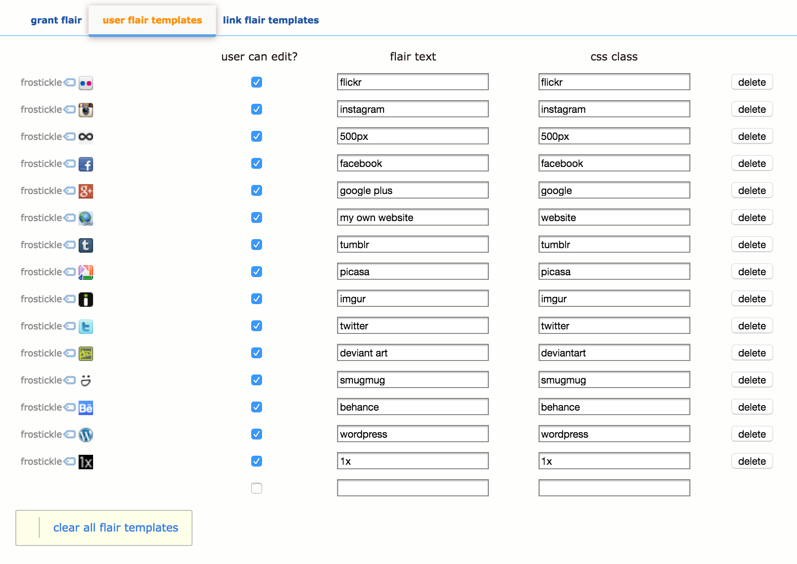

# reddit-user-flair
Icons for user flair on Reddit

# wtf is this?

A flair system for [Reddit], if you don't moderate a subreddit, you don't need to worry about this.

This repo contains instructions on how to set user flair to an icon that can be hovered over to reveal some text.

See this [blog post] for an example.

# Can you make the flair clickable?

No. We don't have that kind of power with CSS.

Go [bug the admins] if you want clickable flair.

# Why did you make this repo?

Hi guys! I'm [/u/frostickle] and I run [/r/photography]. [Someone once suggested that we add flair and I added it really, really quickly] (mostly because I borrowed off the work of [/u/raerth]). Then other people asked me how to add flair and it was easier to get them to mod me and do it for them than to explain how to do it.

Anyway, it's about time I shared the info properly, so that's what this repo is for.

# How it works (theory stuff)

When users pick their flair, they pick a **class** and enter some **text**.

Reddit puts a <span> with that **class** next to their name, with the **text** inside, everywhere on your subreddit.

Our icon flair system is based on sprites, we're going to use CSS to hide the text, and replace it with a 16x16 pixel sprite, based on the class. And reveal the text on :hover (no that's not a typo, the colon indicates that it's... you know what nevermind. You should know basic CSS if you're tackling this stuff, or get someone who knows CSS, or leave us a message in the github issues! Or just [tweet me].) Anyway where was I... 

We select the span based on the class, replace it with an icon. On hover we hide the icon and show the text. Simple.

Getting icons is tricky though, we need to upload a PNG sheet of icons to Reddit. Go to /r/YOUR_SUBREDDIT/about/stylesheet/ to do this. **DO NOT FORGET TO RENAME YOUR FILE**. Reddit will rename your PNG to something stupid, you'll have to rename it back.

Then we reference the icon by attaching the ENTIRE image to our element with .css, then crop it to width: 16px, height: 16px, and position it using background-position: 0px 0px for the first one, and "0px -16px" for the second one and so on. This is really dumb in my opinion but hey it works so let's just roll with it. If this is confusing, create a github issue or [tweet me].

Anyway, these instructions are for people who want to add icons for websites/services/things that aren't already on my list. Hopefully you won't have to do this and you can just follow the quickstart:

# Quickstart (practial stuff)

# 1.
First you need to allow flair on your subreddit. So to your /r/YOUR_SUBREDDIT/about/flair/ and tick these boxes to turn them on (and don't forget to save):
```
[x] enable user flair in this subredditn
[x] allow users to assign their own flair
```

# 2.
[Download all this stuff from github].

# 3.
Copy-paste the css to your stylesheet, it will be at /r/YOUR_SUBREDDIT/about/stylesheet/

If you don't know CSS that well, just chuck it all in at the bottom of your stylesheet. Perhaps put in a "Reason fo revision" while you're at it like "Adding /u/frostickle's icon flair" or something like that so you/future mods will know who to call when stuff is broken.

# 4.
Upload the sprites, we have 2 PNGs that need to be uploaded. This is also on the stylesheet page.

* iconsprite-1.png
* iconsprite-2.png

Reddit will rename them after upload. You'll have to rename them back. Don't forget to save.

# 5.
I'm getting bored of writing this FAQ, so I'm going to be lazy about this last part:

* Go to /r/YOUR_SUBREDDIT/about/flair#templates
* Add whatever flair you want, the screenshot.png in this folder shows how I've done it, you should be able to figure it out yourself. It's just "add flair, type stuff in, type stuff in, hit save"
* The "flair text" can be whatever you want.
* However, column that says "css class" must match the CSS classes in the CSS that we pasted into your stylesheet.




Again, leave an issue or [tweet me] if you're having trouble.

Good luck and all the best, /u/frostickle

[Download all this stuff from github]: <https://github.com/david-ma/reddit-user-flair/archive/master.zip>
[Reddit]: <https://www.reddit.com>
[/u/frostickle]: <https://www.reddit.com/user/frostickle>
[/r/photography]: <https://www.reddit.com/r/photography>
[Someone once suggested that we add flair and I added it really quickly]: <https://www.reddit.com/r/metaphotography/comments/2abjg3/flair_is_coming/>
[/u/raerth]: <https://www.reddit.com/user/raerth>
[blog post]: <http://blog.redditphotography.com/post/91350776113/rphotography-now-has-flair-this-flair-is>
[bug the admins]: https://www.reddit.com/r/ideasfortheadmins/
[tweet me]: <https://twitter.com/frostickle>
